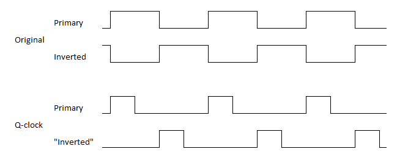

8-bit-CPU
=========

After watching [series of videos][eater-net-8bit] by Ben Eater building an 8-bit computer from scratch,
I was hooked. Various thoughts for improvements and experiments was running through my mind. But first
I have to build one. Improvements will come later.

In contrast to Ben, I'm not that crazy about building the whole thing on breadboards. PCBs are fine,
I like them, but building the whole thing on single board takes away the flexibility. So the plan is
to make a small board for each module and connect them together.

I plan to build a prototype module on breadboard, play around with it and then design and make a PCB
for it. It might also be interesting to make the boards little customizable (leave a chip out, create
a solder bridge, use shorter connector) so that they can be re-used for different purposes.

Of course, some parts of it might stay on a breadboard forever, or I might choose to create PCBs for
those as well. I don't know, time will tell. But the main idea is that it should be possible to swap
out PCBs for breadboards and vice versa.

Key differences from Ben's version
==================================

256 bytes of memory
-------------------

I felt that 16 bytes of total memory might be too tight, went for 8-bit addressing and 256 bytes
of memory straight from the beginning. "Real" 32 KiB SRAM chip is used, with remaining higher address
lines tied to ground. Expanding to 256 bytes does not introduce more complexity, I think that it even
made things easier. I plan to expand further to full 64KiB of memory, eventually.

ROM and bootloader mode
-----------------------

I was not in the mood for _any_ DIP switch toggling for program entry, so I added an EEPROM instead.
Still I did not want to go full Harvard architecture with separate program and data memories, so
there's bootloader mode instead.

To enable it, RAM's Chip Enable is connected together with Write Enable, while ROM's Chip Enable is
connected with Output Enable of the RAM. What happens is that all reads comes from ROM and all writes
goes into RAM.

I have bootloader code in the beginning of the program that copies contents of all 256 bytes into RAM
and then patches itself (in RAM) to be skipped. It is nice to have more memory, since in original
version there are only 16 bytes total, but I can afford to _waste_ similar amount on bootloader.

In _run mode_ ROM's Chip Enable is tied to disabled state permanently, while RAM is permanently enabled.

4 flags
-------

In addition to Z and C flags, there are Negative and oVerflow flags. Took an inspiration from
[AVR Instruction Set Manual][avr-instructions], on how to implement various branching instructions.
N and V flags are required for some. N bit is just a copy of 7-th bit of the result. oVerflow indicates
that the sign bit "overflowed" as a result of addition/subtraction. In short it can be defined as:
*If sign bits of both addition operands are equal, but sign bit of the result is different, the overflow
occured.*

C flag got an additional update to act as a Borrow bit in subtraction. It behaves same way as in
Z80 / AVR / x86 processors. In subtraction the meaning of C is opposite from 6502 or Ben's version,
I find this more intuitive.

256 opcodes
-----------

As memory was expanded to 256 bytes, it was not possible to encode opcode and address in single byte
anymore. Instructions may require multiple bytes anyway now. Instruction Register loads 8-bit opcode and
extra arguments are fetched from RAM when needed, there's room for 256 opcodes.

However, number of opcodes is also limited by capacity of control EEPROMs. 8 bits for opcode + 4 bits
for flags + 3 bits for instruction step = 15 address lines. This calls for 32K EEPROM - 28C256. They
felt a little pricey when I ordered parts and I was not completely sure if I'll really need them. For
now I only have 28C64 chips, limiting number of opcodes to 64. It is still 4 times more than in Ben's
version.

I could probably lose one or both extra flags (not using N and V that much for now) and re-use address
lines for opcodes, but I think I'll upgrade the EEPROMs or check out Flash chips instead.

Modular ALU
-----------

While currently there is only single module for Add and Subtract (with or without carry/borrow),
design allows additional modules for other operations - AND/OR, XOR/NOT, SHIFT.

Flags register as an independent entity
---------------------------------------

Zero flag's calculation takes input from the Bus, instead of being embedded in ALU module. This allows
to add additional ALU modules and keep just one instance of Z calculation circuitry. Additionally, it
is possible to calculate flags for anything on the Bus, for example - while loading byte from memory.
There's additional function for flags register to be sent and loaded from bus directly. Currently
there is no use for that, but it may become handy if flags need to be saved and restored for some reason
(perhaps, to implement interrupts).

Double-latching registers
-------------------------

One of the main sources of instability in Ben's design is that registers' "tap outputs" (ones that
connects registers to ALU, RAM or Control Logic) change immediately when new value is latched.
This is especially important with Flags and Instruction Register, as it creates the infamous
"EEPROM noise" on the rising clock edge, when it can cause unexpected effects. It might not be such
an issue for general-purpose registers or MAR, but it is better that everything holds steady while
the clock line is high.

The double-latching technique adds additional D flip-flops between register's primary ones and its
"tap output". These additional flip-flops are configured to latch on the inverted clock, therefore
output stays unchanged until the falling edge.

Dual-output registers
---------------------

General purpose registers got dual 3-state "tap outputs". Instead of ALU inputs being hardwired to
registers A and B, now (with appropriate control signals) it is possible to connect them differently,
for example do A + A directly. It also allows additional registers (C and D), that could be used
with ALU directly. Currently this feature is not used and control lines are wired for steady "on",
but the potential is there.

Quarter-clock
-------------

One of the sources of instability in Ben's version is RC-circuit used as an edge detector in RAM
module. A common technique is to isolate the circuit using extra logic gates, so that it does not
send spikes back in clock line. I, however, decided to eliminate the need for edge detection
completely. The thing with RAM is that it will keep loading the value all the time while Write Enable
line is enabled. If inputs change, the last value will be stored, which may not be one we want if
Write Enable is disabled on same moment as other control lines starts to change. Ben solved it using
edge detector circuit, I went in another direction and introduced a "dead time" between moment when
primary clock line goes low and inverted clock rises.

Added a counter (could have been anything that can divide the frequency) and few NOR gates on the
*clock module* I generate two 25% duty-cycle clock signals, that are offset by half of the cycle. It
looks like this:

Part of the cycle when both clocks are low ensures that RAM's Write Enable is not active when control
lines or bus changes.

While it is required only by RAM module, I see no downsides for using it globally (it might be an issue
at high clock frequencies, though). Also, now other un-clocked parts (e.g. 193 counter for Stack Pointer)
can be introduced without worries.

Muxed control lines
-------------------

A great way to save bits in Control EEPROMs is to add demultiplexers, which activates just a single line
from several. For example, by using 74*138 demultiplexer one can expand 3 bits to 7 control lines
(technically - to 8, but you need to reserve one as "unused"). Currently there are 2 demultiplexers
used - for OUT and for LOAD lines. For OUT it also prevents "invalid" conditions, such as multiple
modules trying to output value on the bus.

While, in theory, there might be need to load same value into multiple modules simultaneously, I've
not yet encountered one, and I'm happy to live with that limitation.

Arduino + Python test module
----------------------------

It started with hooking up an Arduino (on its own at first, then expanded output with 595 shift registers,
expanded even more with 139 demultiplexers and finally added 165 for expanded input) and writing some
sketches to verify if modules work as expected. Soon I realized that the environment is a bit limited
and while it can prove that everything works, it is not very helpful for diagnostics.

Reducing the functions of Arduino to "set control lines", "put to bus", "read from bus", "read flags",
"pulse a clock", etc. and implementing higher level logic in Python, makes it more flexible and quicker
to develop. Wrote a "client" that uses interactive input for diagnostics.

Started to implement Python functions that acts as an assembly instructions - for example: add(A, B)
switches all control lines and issues clock ticks as needed for the addition operation. Basically -
implemented microcode in Python. Later, with refactoring it became my main microcode definition and
is used as primary source for microcode EEPROM contents.

Using the instruction-like functions and [pytest][pytest] framework wrote a quite thorough test suite.
It can check couple hundred scenarios in just few seconds and point out if something does not work as
expected. It has already saved me several times, when I did some rewiring.

With help of these instruction-like functions I also wrote some demo programs. Largest one is Sieve
of Eratosthenes - it finds all 8-bit prime numbers. All variables/arrays required for algorithm are
stored in the RAM. The control flow reads its input only from Flags register.

With some "clever" manipulations, I add necessary labels and jumps to replace Python's while/if/
continue/break control flow. The resulting code is ran using alternate "backend" that generates
machine code, instead of sending it to hardware directly. Machine code that can be written into program
ROM or loaded into RAM by different means.

At the moment the test module is swapped out for "real" EEPROM-based Control Logic, but I'll definitely
find a way to use both of them in parallel, as it is too useful to be retired.

Side-project: EEPROM writer
---------------------------

As a side project I also built an EEPROM writer: PCB version - an Arduino Uno shield. It can program
DIP-28 EEPROMs (AT28C64 and AT28C256) and PLCC-32 versions of same chips. Main principle is same as in
Ben's version, but wiring is different, because it uses Arduino's SPI module to work with shift registers
(it is much faster than shiftOut() method). Additional headers on the board gives access to "address" and
"data bus" pins, so the board can be used for different purposes when no EEPROMs need to be programmed.
I used it as the Test Module at first.

Repository index
================

* **.github** - configuration files for GitHub integration, e.g. workflows for GitHub Actions
* **.vscode** - configuration for Visual Studio Code
* **arduino** - Arduino sketches and C++ code, to help test and automate things
    * **bouncyy** - software button debouncer and "rebouncer"
    * **eeprom_burner** - sketch to write 7-seg, microcode and program ROM, onboard content generation
    * **emulpins** - hardware emulator. Speaks same protocol as **pincontrol**. Can also be built for/ran on Linux
    * **lib** - some common routines
    * **modules_test** - (deprecated) module tester
    * **pincontrol** - substitute Control Logic. Controlled via serial link from **pycontrol**
    * **serprog** - (abandoned experiment) attempting to implement SerProg ([FlashROM][flashrom]) for EEPROM programmer
    * **xmprog** - (very early stage) XMODEM-compatible EEPROM programmer
* **doc** - some (mostly outdated) design thoughts, BOM, etc.
* **hardware** - hardware schematics, boards, etc.
    * **breadboard** - Fritzig projects for some modules
    * **pcb** - KiCad schematics and boards
        * **alu_back** - backplane board for ALU and GP registers
        * **aunit** - Arithmetic Unit (ALU module for addition and subtraction)
        * **clock** - (unfinished) Clock module
        * **control** - (unfinished) Control Logic
        * **display_back** - backend board for Output module (7-seg display)
        * **display_front** - frontend board for Output module (7-seg display)
        * **eeprom_burner** - EEPROM writer as Arduino Uno shield
        * **flags** - Flags register
        * **keyboard** - (unfinished) 4x4 keyboard scanner module
        * **lunit** - Logic Unit (ALU module for AND and OR)
        * **modules** - Register, ALU, etc. boards as KiCad footprints (for backplane)
        * **ram** - (unfinished) RAM module
        * **register** - GP register
* **parts** - custom KiCad symbols and footprints for missing components
* **pycontrol** - Python-based control logic, microcode, tests, demo programs, etc.
    * **demo** - demo programs in PyASM or Assembly
    * **libcpu** - main implementation of control logic, microcode
    * **localpath** - helper lib, bring arbitary locations in package search path
    * **stubs** - MyPy type definitions for packages that lack those
    * **tests** - PyTest scripts, testing (real or emulated) hardware and PyControl itself
    * **tools** - various tools that generates microcode, customasm definitions, execute and debug binaries
        * **export-c** - exported C and .def files
* **simulation** - [Logisim][logisim] and [Digital][digital] simulations for tricky logic

Progress
========

* Created Github project and added few most immediate tasks
* Wrote an introductionary README (this one ;-) )
* Decided on overall design
* Compiled list of modules and parts for first experiments, placed an order with my favorite supplier
* Found Arduino, breadboard and few 7-segment displays at home. Time to practice!
* Built breadboard prototypes for Clock, Register, Counter, Display and EEPROM burner
* Built ALU, complete with upgraded Flags register.
* Wrote some [blog posts][velkoraspi] about the "adventures"
* Arduino-based testing device. Connect the module, run a command and it verifies that module works
  as expected.
* Designed, soldered PCB versions of Register, ALU, Flags and EEPROM programmer
* Reworked testing device - moved most logic to "client" side. Coding in Python is a lot quicker
  than constantly re-flashing the Arduino. Can use unit-test framework, use debugger, quick edits.
* Beginnings of instruction set.
* Soldered 2 more Registers, to be used as MAR and IR
* Built breadboard prototype of RAM module (placed MAR and IR on it), wrote some unittests for it
* Wired both ALU and RAM blocks to Arduino, merged test suites
* Hey, it can calculate and there's memory. That should be enough to do something more complex.
* Developed Sieve of Eratosthenes - calculate prime numbers up to 256. A Python program, which uses
  assembly-like functions to manipulate the ALU and RAM modules. All variables/arrays required for
  algorithm are stored in the RAM. The control flow reads its input only from Flags register. This
  should be almost 1:1 translatable to assembly / machine code
* Play around with Python AST visitor to automatically "flatten" the program and add necessary labels
  and jumps to replace Python's while/if/continue/break control flow. When executed, this program generates
  machine code.
* Built a dedicated "debug control" board using Nano, shift registers and demultiplexers
* Connected Program Counter and "read-back" from IR into Arduino. Should be able to "run" programs from
  memory
* Developed a Python-side instruction interpreter, which uses input from IR and flags to select and
  execute appropriate microcode steps. Now it really runs machine code, albeit using weird (and very slow)
  control logic
* Developed utility that dumps current microcode (Python) definitions to C arrays.
* Wrote an Arduino-side instruction interpreter that uses the C microcode arrays and input from IR and
  Flags. Now can run programs without Python-side involvement
* Added an EEPROM in RAM module. Added a bootloader code in the Prime Sieve demo. The bootloader copies
  contents from ROM into RAM and patches itself to be skipped next time
* Implemented a "quarter clock" on the Clock board. Now it produces two 25% duty-cycle clock signals,
  instead of two 50% ones. This should eliminate need for edge-detection circuitry in RAM module.
* Built an EEPROM-based control board. Flashed microcode into ROMs.
* Swapped out Arduino-based control board with EEPROM-based one. A very error-prone operation, I must admit.
* IT'S ALIVE!!! The Sieve of Eratosthenes runs without involvement of any additional processor!
* I pushed it for speed. Initially there were some instability, but I noticed that connection of N flag
  from Flags to Control Logic was loose. Nothing in the code uses N flag for now, that's why it did not
  fail immediately. Once that was fixed, it appears to be rock-solid. I even pulled the capacitor from the
  astable clock, making it go as fast as it can. It's been running that way for over a week - not a single
  misstep.
* Some shooting, video editing and [announcement on Reddit][first-announce].
* Working on updated versions of boards, as there were design issues
* Improving reliability of Python code by adding type annotations
* Wrote emulators. Python-side instruction interpreter for quick code debugging and in-Arduino hardware
  emulator. These should help to move software side forward while there is no combined Arduino- and
  EEPROM-based control logic.
* Fixed/redesigned new versions for Arithmetic Unit and Flags boards. An experimental ALU backplane.
* Extended in-Arduino hardware emulator to 16-bit addressing. An easy way to check out various ideas
  before actually building the hardware.
* Adopted [CustomAsm][customasm] for machine code generation. Can retire my own Python-Assembly.
* Developed a debugger (breakpoints, single step, live register inspection).
* Designing additional ALU modules, miniaturized Display module.

[eater-net-8bit]: https://eater.net/8bit
[velkoraspi]: https://velkoraspi.blogspot.com/
[avr-instructions]: http://ww1.microchip.com/downloads/en/devicedoc/atmel-0856-avr-instruction-set-manual.pdf
[pytest]: https://docs.pytest.org/en/stable/
[first-announce]: https://www.reddit.com/r/beneater/comments/loy9kj/important_milestone_it_works/
[customasm]: https://github.com/hlorenzi/customasm
[flashrom]: https://flashrom.org/Flashrom
[digital]: https://github.com/hneemann/Digital
[logisim]: http://www.cburch.com/logisim/
